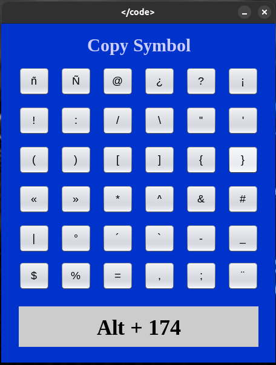

# Copy Simbol

Esta aplicación está diseñada para facilitar el acceso a símbolos especiales que no siempre están disponibles en todos los teclados, como `#`, `&`, `[`, `{`, entre otros. Proporciona una interfaz gráfica simple e intuitiva, similar a una calculadora, donde cada botón representa un símbolo.

## Características principales:
- **Copia rápida al portapapeles:** Haz clic en un botón para copiar el símbolo al instante.  
- **Visualización del código ASCII:** Cada vez que se selecciona un símbolo, se muestra su código ASCII en un área dedicada.  
- **Diseño amigable:** La interfaz está pensada para ser minimalista y fácil de usar, ideal para cualquier persona que necesite acceder rápidamente a estos caracteres.  

## Ejemplo de uso:
1. Abre la aplicación.  
2. Haz clic en el botón del símbolo que necesites (por ejemplo, `#`).  
3. El símbolo se copiará automáticamente al portapapeles y podrás pegarlo donde quieras.  
4. Observa el código ASCII correspondiente en la parte inferior de la interfaz.  

## Tecnologías utilizadas:
- **Lenguaje:** Java  
- **Interfaz gráfica:** Java Swing.  
- **Utilidad del sistema:** Gestión del portapapeles de Java.  

### Método utilizado para copiar al portapapeles  

El flujo para copiar símbolos al portapapeles es el siguiente:  

1. **Obtención del texto del botón:**  
   - Se recupera el texto del botón presionado utilizando `buttonText.getText()`, que representa el símbolo seleccionado.  

2. **Búsqueda del código ASCII:**  
   - Se consulta un `HashMap` (`asciiMap`) utilizando el texto del botón como clave para obtener el código ASCII correspondiente.  
   - El código ASCII se muestra en un `JLabel` en formato `"Alt + código"`.  

3. **Copia al portapapeles:**  
   - Se crea un objeto `StringSelection` con el símbolo como contenido.  
   - Se utiliza la herramienta del sistema `Clipboard`, obtenida mediante `Toolkit.getDefaultToolkit().getSystemClipboard()`.  
   - Se llama al método `setContents` del portapapeles, pasando el `StringSelection` como argumento.  

Este método asegura que el símbolo seleccionado se copie de forma eficiente al portapapeles, facilitando su uso inmediato.

---

Esta herramienta es ideal para desarrolladores, escritores o cualquier usuario que trabaje con símbolos especiales en teclados en inglés y desee optimizar su tiempo.  
¡Contribuciones y mejoras son bienvenidas!
